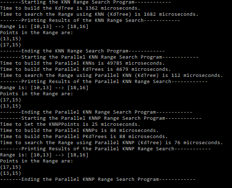

# ProximitySensor
KNN Range Search based on KdTree as the Backing Data Structure

**What is KNN anyways?  **
K --> Number of Dimensions  
NN --> Nearest Neighbors  

**Hmmm ... then What is a KNN Search?  **
KNN Search is an Algorithm that enables you to find Nearest Neighbors in a K Dimensional Data Set!  

**How the heck does it work?  **
It uses a KD Tree as a backing data store Data Structure!  

**Now, what is a KD Tree anyways?  **
It's a K-Dimensional Analog of a Normal Binary Search Tree!  

**What are it's constituents? **
It consists of basically two types of Nodes ....  
<1>Bounding Boxes [Non-Leaf Nodes]  
<2>Point Nodes [Leaf Nodes]  

At each Level of the KD Tree, there are Cut-Dimensions that cycle alternately between the K Dimensions!  

For eg. in a K=2 i.e a Planar Structure ....  
At Root-Level (0) ==> Cut-Dimension = X-Axis  
At Level (1) ==> Cut-Dimension = Y-Axis  
At Level (2) ==> Cut-Dimension = X-Axis .... and So On ....  

**So, How do we Traverse a KD Tree?  **
We Start from the Root or any Concerned Node ....  
Determine the Cut-Dimension .... and check just like we do in a BST .... if the Point's Concerned Dimension Value is Less Than that of Cut-Dimension Value ..... go ==> Node->Left .... else go ==> Node->Right!!!  
We do this exercise till we reach a Leaf Node ... which is the Actual Point & then We check if the Point's Value is the same as that of the Search Point Value or Not! 

**But....there's a catch!!??  **
We need to Search the other Half of the Sub Tree if the Cut-Dimension Level is not the One We are Searching For!!!  

**Back to the KNN Search.... **
We are using the Version of the KNN Search called Range Based Searching!!!  

**Okay ... so How's that different from the Regular KNN Search?   ... & what on earth is a Range here?  **
In this version of the Search called KNN Range Based Searching .... we have the Following ....  
0. K ==> 2 for example a 2-D Cartesian Plane.  
1. Points[] ==> Set or Vector of Points (random) in a Plane.  
2. Range ==> A Range to search for eg. [1,2] --> [5,8] .... a Rectangular Region within which we wish to find all the points that lie completely within or on it!!!  
3. Region ==> A Outer Clipping Window or Bounds for the KD Tree ... for eg. [0,0] --> [21,21]  
4. The KD Tree ==> Like Described above .. storing all Points[] in it's respective Leaf Nodes!!!!  

**Alright!!....Coming to the Code Now.... What do we have to explore now? .....  **
This Implementation is Divided into 3 parts .....  
1. Serial Version of KNN Range Based Search  
2. Pseudo-Parallel Version of the KNN Range Based Search  
3. Parallel Version of the KNN Range Based Search  

**Hmmm .... how are they different from each other?  **
1. The Serial One ===> uses Naive Serial Tree Building & Searching!!!.... with Normal Serial Containers .... vector<int> for instance!  
2. The Pseudo-Parallel One ==> Uses the Naive Serial Tree Building Structures (Containers) ... but runs the Build in Parallel!!! & the Search is using Parallel Containers!!!  
3. Parallel One ==> Uses Completely Parallel Containers for Tree Building & Searching as well!!!!  

**Structure of this Repository is as follows....  **
1. ProximitySensor ===> the Main Driver Solution ... which runs all the 3 versions on the Algorithms as discussed above with results and timings!!! .... This is where to get Started .....  
2. KNN ===> The DLL for KNN Search .... all the 3 .... Serial, Pseudo-Parallel & Parallel Versions of Them!!!  
3. KDTree ===> The DLL for the KD Tree .... both the versions ... Serial as well as the Parallel Versions of them!!!  

**Wow!!!... So what's special about the Parallel Versions of the Algorithms?  **
Simply 3 things only .....  
1. They used Data Partitioning of Chunks of Point[] based on N=4 for instance!!!  
2. Build Parallel KNN Objects using Parallel Containers ... like concurrent_vector<int> etc...  
3. Run parallel_for internally for each of the Parallel KD Tree Structures & the KNN Search Functions!!!!  

**Ok...So what's the use of this KNN Search thingy anyways?  **
Giving a very Crude Example ....  
If we want to find People with similar tastes for example ....  
1. The Food & Drinks they like ....  
2. The Songs they listen to ....  
3. The Movies they watch ....  
4. The Books they read ...  
..... etc. ...  
This becomes for instance a 4-Dimensional Search Problem ....   .... with each of the above Parameters or Interests .. We can find the closest such People with matching tastes ... using the KNN Range Based Search Algorithm ....!!!!  

**There's More ....  **
Based on the Thresholds we set we can expand or contract our region to find the Nearest Neighbors and the people with similar tastes ....  
Also, taking it one step further .... we can even do Auto Suggestions based on this data for similar people are More likely to have similar tastes ....  
The above falls into Data Science & AI & ML ....  

**Cool....This is not Rocket Science anymore ... !!!  **
So, by using the KNN Range Based Search one can easily find out the Nearest Neighbors ... This has numerous applications in Business as mentioned above ... and in Computational Geometry ... Crude .... Algorithms .. like finding Nearest Points in a 2-D Plane or 3-D Space or for that matter even 1-D Line ... !!!!  

**What Next???  **
Go through the Code .... explore the Implementation .... !!!   AND ....  
Do Not Forget to Run it on your System!!!  
Play with it ...  
Tinker with it ...  
Tune the Parameters and see how it behaves ....  
& ....  
Feel free to improvise and see if you can extend this to other forms and applications as well!!! ...  

**A Glimpse at the Output .... To get you Started!!!  **
    

**Wrapping Things Up!!!  **
I Hope that this Personal Project of Mine would have shed light on the Intricacies of the KNN Range Based Search Using KD Trees and it's Parallel Versions given some rationale of how to Parallelize Algorithms esp. using the Parallel Patterns Library in VC++ ....  

**I hope you guys would have found this Project Useful..!!!!  **
So, my request to you avid programmers out there is to take this to the next level or implement something on similar lines in the language of your choice or liking!!!  

**That's All Folks!!! ....  **

Have a Great Time with KNN Searches!!!  

&  

Happy Coding!!!  

:-)  

Best Regards,  
Bhaskar Rao.
